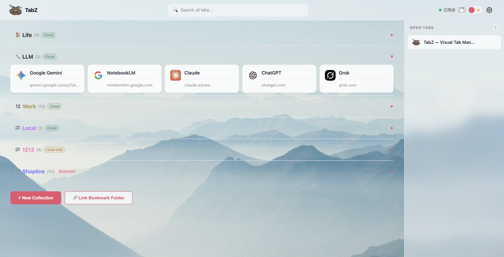

# TabZ



## English

A Chrome extension that replaces your new tab page with a visual tab manager. View and organize all your open tabs at a glance, group them into collections, link bookmark folders, sync to Google Drive, and customize your workspace — all from a single, intuitive new tab page.

### Installation

1. Download the source code

```bash
git clone https://github.com/ianccy/TabZ.git
```

Or download and unzip the ZIP file from GitHub.

2. Open Chrome Extensions page

Navigate to `chrome://extensions` in your browser, or go to **Menu (⋮) → Extensions → Manage Extensions**.

3. Enable Developer Mode

Toggle the **Developer mode** switch in the top-right corner.

4. Load the extension

Click **Load unpacked** and select the project folder (`TabZ/`).

5. Done

Open a new tab — TabZ will replace the default new tab page.

### Features

- **Collections** — Group saved tabs into named collections with custom colors and icons
- **Drag & Drop** — Reorder collections and tabs by dragging
- **Linked Folders** — Link existing Chrome bookmark folders as live collections
- **Google Drive Sync** — Sign in with Google to sync collections across devices via Google Drive
- **Local Drafts** — Unsaved collections stay as local drafts; choose which to upload when signing in
- **Export as Bookmark Folder** — Export any collection as a Chrome bookmark folder
- **Background Customization** — Set a custom background color or image URL
- **Dark / Light Mode** — Toggle theme with one click
- **Search** — Search across all collections and open tabs
- **Import / Export** — Backup and restore collections as JSON
- **i18n** — Supports English and Traditional Chinese

### Data Flow

#### 1. Linked Collections

- Source of truth: Chrome bookmark folders you explicitly link
- Read/write behavior: TabZ reads live bookmark content and reflects bookmark changes in place
- Sync behavior: Not uploaded to Google Drive; they stay bookmark-backed and device/account-independent inside Chrome bookmarks

#### 2. Local Draft Collections

- Source of truth: Local bookmark folders marked as draft (not yet uploaded)
- Read/write behavior: Create/edit/delete operations are stored locally first
- Sync behavior: On sign-in/account switch, you can choose which drafts to upload or keep local

#### 3. Cloud Collections

- Source of truth: `tabz-data.json` in Google Drive folder `TabZ_Storage`
- Read/write behavior: Changes are persisted to local cache and pushed to Drive (debounced or immediate)
- Sync behavior: After sign-in, TabZ force-pulls remote data into local cache; later background checks pull updates when remote is newer

### License

This project is licensed under [CC BY-ND 4.0](https://creativecommons.org/licenses/by-nd/4.0/). You may share and use it, but modification and redistribution of modified versions are not permitted.

## 中文

Chrome 新分頁擴充功能，提供視覺化的分頁管理介面。一覽所有開啟的分頁、分組收藏、連結書籤資料夾、同步至 Google 雲端硬碟，並自訂你的工作空間。

### 安裝

1. 下載原始碼

```bash
git clone https://github.com/ianccy/TabZ.git
```

或從 GitHub 下載並解壓縮 ZIP 檔案。

2. 開啟 Chrome 擴充功能頁面

在瀏覽器中前往 `chrome://extensions`，或選擇 **選單 (⋮) → 擴充功能 → 管理擴充功能**。

3. 啟用開發人員模式

開啟右上角的 **開發人員模式** 開關。

4. 載入擴充功能

點擊 **載入未封裝項目**，選擇專案資料夾 (`TabZ/`)。

5. 完成

開啟新分頁，TabZ 將取代預設的新分頁頁面。

### 功能

- **分類收藏** — 將分頁分組收藏，支援自訂顏色與圖示
- **拖放排序** — 拖放重新排列分類與分頁
- **連結書籤資料夾** — 連結既有的 Chrome 書籤資料夾作為即時收藏
- **Google 雲端同步** — 登入 Google 帳號，透過 Google 雲端硬碟跨裝置同步收藏
- **本機草稿** — 未同步的收藏保留為本機草稿，登入時可選擇要上傳的項目
- **轉存為書籤資料夾** — 將收藏匯出為 Chrome 書籤資料夾
- **背景自訂** — 自訂背景顏色或圖片網址
- **深色 / 淺色模式** — 一鍵切換主題
- **搜尋** — 跨收藏與開啟分頁搜尋
- **匯入 / 匯出** — 以 JSON 備份與還原收藏
- **多語系** — 支援英文與繁體中文

### 資料流

#### 1. Linked（連結書籤）

- 真實資料來源：你手動連結的 Chrome 書籤資料夾
- 讀寫行為：TabZ 直接讀取/操作該書籤資料夾，內容即時反映
- 同步行為：不會上傳到 Google Drive；資料維持在 Chrome 書籤體系

#### 2. Local（本機草稿）

- 真實資料來源：本機書籤中的草稿收藏（尚未上傳）
- 讀寫行為：新增/編輯/刪除先落在本機
- 同步行為：登入時可選擇要上傳到雲端，或保留在本機；若需更換帳號，請先登出再重新授權登入

#### 3. Cloud（雲端收藏）

- 真實資料來源：Google Drive `TabZ_Storage` 資料夾中的 `tabz-data.json`
- 讀寫行為：變更會先更新本機快取，再推送到 Drive（可 debounce 或立即）
- 同步行為：登入後會強制 pull 雲端覆寫本機快取；之後背景同步再依遠端較新時拉取更新

### 授權

本專案採用 [CC BY-ND 4.0](https://creativecommons.org/licenses/by-nd/4.0/) 授權。您可以分享與使用，但不得修改或散佈修改後的版本。
